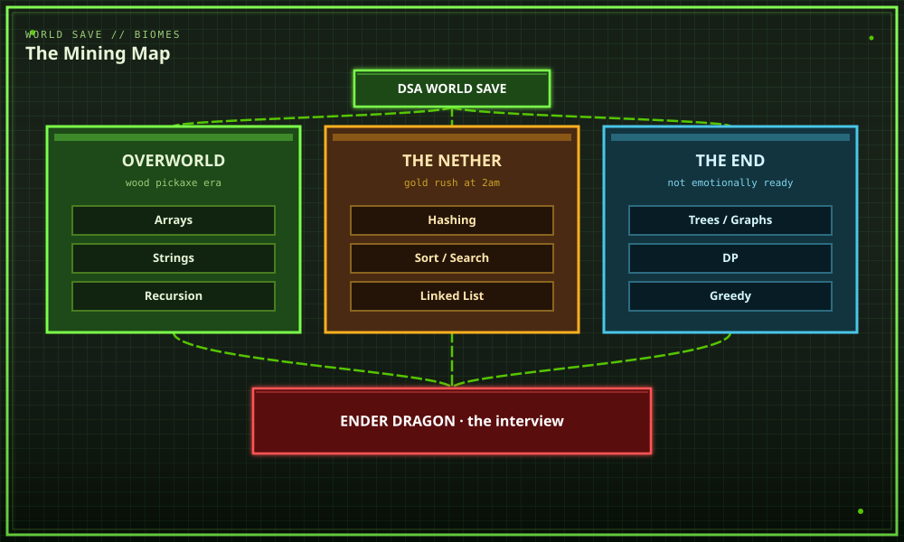
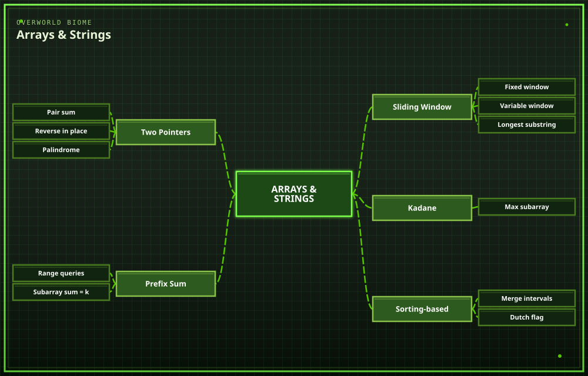
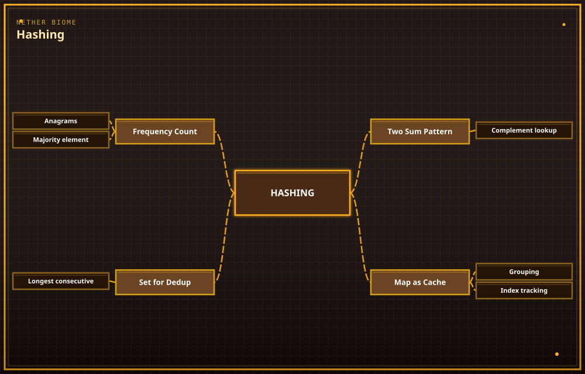
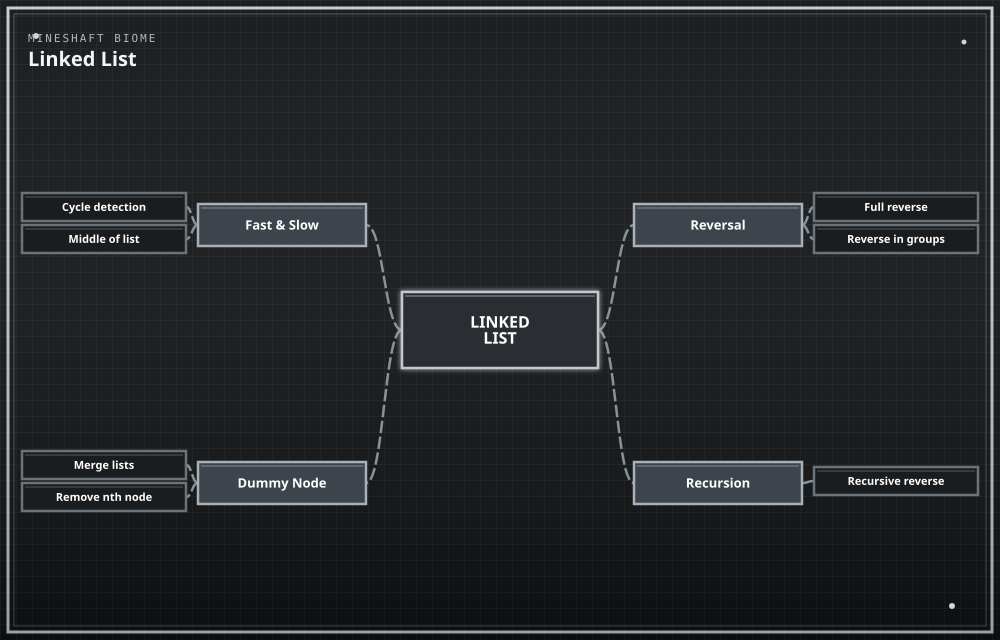
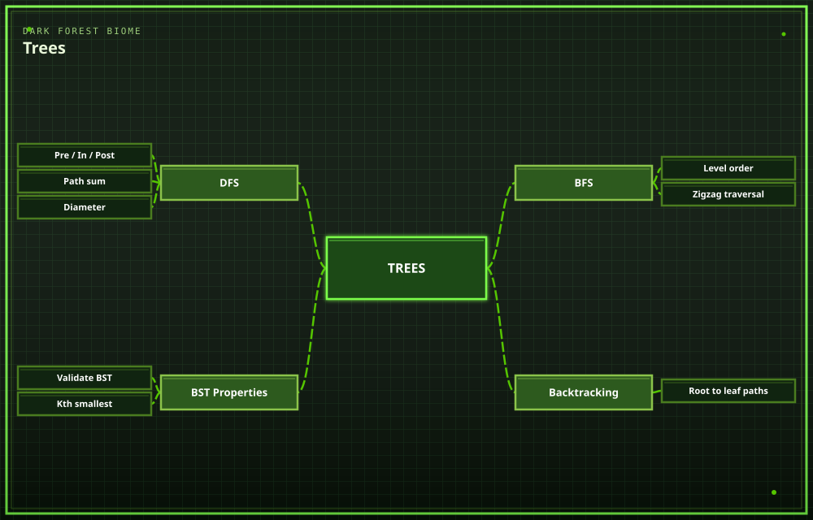
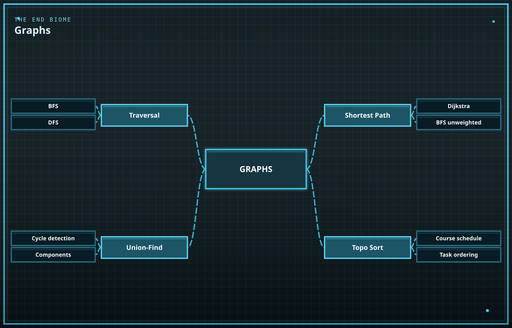
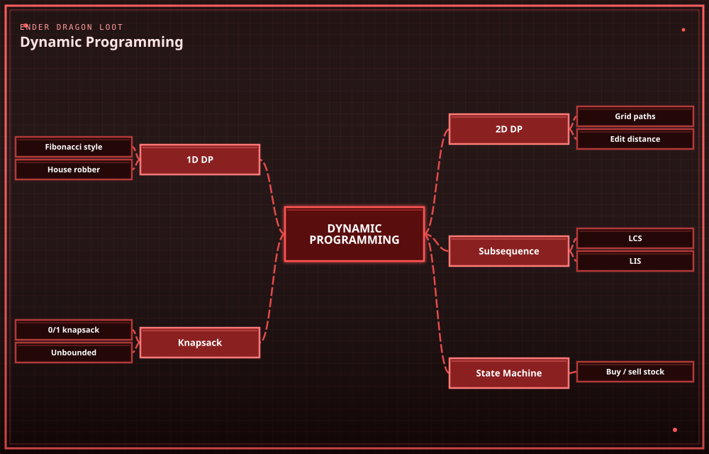
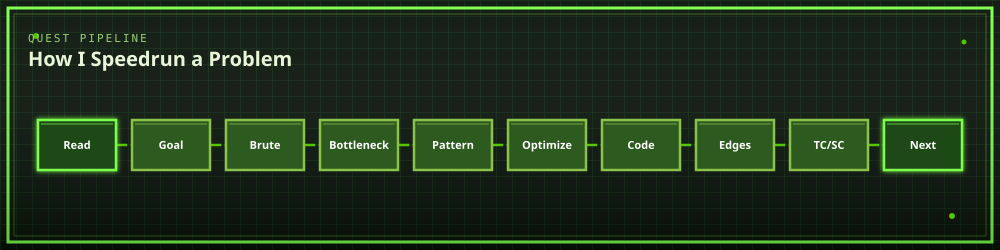

<div align="center">


**`mine the problem → craft the solution → survive the interview`**


<br/>


</div>

---

## 

Welcome to my **DSA world save**.

This is not a tutorial. This is a hardcore world where I punched wood, cried at recursion, and accidentally deleted half a linked list because I forgot the dummy node.

Java is the pickaxe. LeetCode is the nether. The interview is the Ender Dragon and I am currently eating rotten flesh in a dirt hut.

No copy-paste farming. No *"I looked at the recipe once so I know how to craft it"* nonsense. If I didn't mine it myself, it doesn't go in the chest.

> **Spawn → Mine → Craft → Die to a creeper named TLE → Debug → Level Up → Repeat.**

---

## 

<p align="center">
  
</p>

Overworld is arrays. Nether is hashing at 2am. The End is DP and I am not emotionally ready.

---

## 

<div align="center">

*Every biome hides recurring loot tables — learn the drop, not just the block.*

If you treat every problem like a brand new mob, the same skeleton will jump you 400 times. That's not grinding. That's a skill issue.

</div>

<p align="center">
  
</p>

<p align="center">
  
</p>

<p align="center">
  
</p>

<p align="center">
  
</p>

<p align="center">
  
</p>

<p align="center">
  
</p>

DP is remembering what you already mined so you don't punch the same stone 10⁷ times. If your solution is exponential, you are strip-mining with your fists.

---

## 

<div align="center">


</div>

Java is the main weapon. C++ is the spare netherite sword I pull out when I want undefined behavior to keep me humble.

---

## 

<p align="center">
  
</p>

If I skip brute force I skip the wooden pickaxe and then I am punching diamond ore with my hands. Do not do this. I have done this.

---

## 

<div align="center">

| Achievement | Description |
| :--: | --- |
| 🟨 **Taking Inventory** | Solved first 50 array problems |
| 🟨 **Diamonds!** | Cracked first optimal-pattern solution without hints |
| 🟨 **Isn't It Iron Pick** | Refactored brute force → O(n log n) |
| ⬜ **We Need to Go Deeper** | Clear all Tree + Graph problems *(locked)* |
| ⬜ **The End?** | Clear a mock interview *(locked)* |
| ⬜ **Free Diamonds** | Land the placement offer *(locked)* |
| ⬜ **How Did We Get Here** | Pass a DP problem on the first try *(mythical, probably fake)* |

</div>

---

## 

```yaml
Java:            Sharpness V     # main weapon
Problem Solving: Efficiency IV
Debugging:       Unbreaking III
Patience:        Mending
Consistency:     Fire Aspect II
Ego:             Knockback I     # still takes fall damage from WA
Copy-Paste Code: Curse of Vanishing   # actively avoided
```

---

## 

```diff
+ Understand the recipe before crafting it
+ Prefer known patterns over random punching
+ Start with the wooden pickaxe (brute force)
+ Upgrade to diamond only when there's a reason
+ Write clean, well-lit Java (no dark corners for bugs to spawn)
+ Test against every mob type (edge cases)
+ Revisit ruins I couldn't loot the first time
+ Sleep through the night. Recursion at 3am summons phantoms

- Blindly copy someone else's build
- Memorize the recipe without knowing what it crafts
- Skip checking durability (complexity analysis)
- Log off after one creeper blows up the base
- Keep Inventory on. If you die, you drop the wrong approach and walk back
```

---

## 

> *"If I can't clear this biome today, that's fine.*
> *Future me respawns with better gear."*

Every problem I can't solve is a structure map I didn't ask for. Every WA is a creeper I heard too late. Every AC is a bed I placed in the nether by accident and somehow lived.

Keep Inventory is off. Pride is off. The grind is on.

---

<div align="center">

### ⛏️ MINE → CRAFT → BREAK → DEBUG → REPEAT

**Built with Java ☕, redstone logic, and a concerning number of respawns**

`gamerule doDaylightCycle false` — it's always grind o'clock in this world.

</div>
